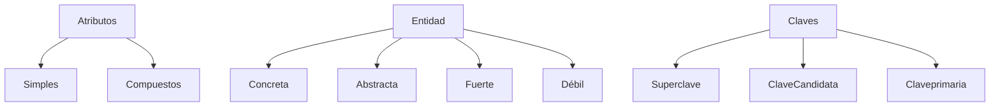

# Modelos de datos
## Modelos basados en objetos
## Modelos basados en registros
- Se utiliza para describir datos a nivel físico.
## Entidades
Es un objeto que existe y es distinguible de otros objetos.
- Concreto: persona, empleado, casa, auto.
- Abstracto: cuenta bancaria, empresa.

La entidad está representada por un conjunto de *atributos*.

## Atributos
- Yn atributo es una función que asigna al conjunto de entidades.
Son propiedades específicas que describen la entidad.
- Ejemplo: Una persona puede describirse con nombre, edad dirección.

### Tipos
- Simples:
- Compuestos:

## Dominio
Es el conjunto de **valores permitidos** para un atributo.

## Claves
- Superclave
- Clave candidata
- Clave primaria

