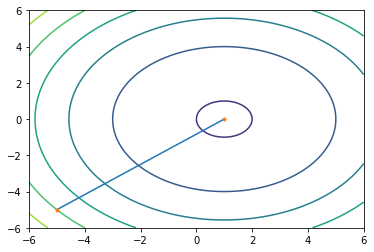

## Problema 1
### Solución A

``` python
from sympy import *

def main():
    lista = [1, 1]
    epsilon1 = 0.00000001
    epsilon2 = 0.00000001
    lista_variables=['x', 'y']
    x = symbols('x')
    y = symbols('y')
    f = x*2(2.62*x) + y2(2.62**y) + 1
    gradient = lambda f, v: Matrix([f]).jacobian(v)
    iteraciones = 0
    while True:
        iteraciones+=1
        gradiente = gradient(f, lista_variables)
        hesiano = hessian(f, lista_variables)
        gradiente = gradiente.subs(x,lista[0]).subs(y,lista[1])
        hesiano = hesiano.inv()
        hesiano = hesiano.subs(x,lista[0]).subs(y,lista[1])

        S = -1*gradiente*hesiano
        if len(lista) != len(S):
            print("there is an error")
            return
        else:
            anterior = lista
            for i in range(len(lista)):
                lista[i] = lista[i] + S[i]
            if abs(f.evalf(subs={x:lista[0], y:lista[1]}) - f.evalf(subs={x:anterior[0], y:anterior[1]}))>epsilon1 or gradiente.subs(x, lista[0]).subs(y, lista[1]).norm()>epsilon2:
                continue
            else:
                print("cantidad de iteraciones= ",iteraciones, " y ha convergido en los valores:", lista, "con f_evaluada=", f.evalf(subs={x:lista[0], y:lista[1]}))
                return

if _name_ == "_main_":
    main()
```

### Solución B
``` python
def newton_generalization(vector_x, epsilon1, epsilon2,  string_symbols, delta_x, f):
    '''
        epsilon1 -> tolerancia de la funcion de la iteración pasada
        epsilon2 -> tolerancia en el valor del gradiente
        string_symbols -> the letters that we are using in our function.
        
        Es la generalización del algoritmo de Newton-Raphson para N dimensiónes.
    '''
    print(f)
    gradient = lambda f, v: Matrix([f]).jacobian(v)
    v = list(symbols(string_symbols))
    #v = list(ordered(f.free_symbols))
    gradiente = gradient(f, v)
    #print(gradiente)
    assert len(gradiente) == len(vector_x),  'vector_x and gradient have different sizes, you should check either your symbols_string or vector_x'
   
    hessiano = hessian(f, v)
    hessiano_inverso = hessiano.inv()
    #m = symbols(string_symbols)
    #list_m = list(m)
    #derivatives = [diff(f, i) for i in m]
    evaluar = dict(zip(v, vector_x))
    f_valued_at_points = 0.0
    f_valued_at_points = f.evalf(subs=evaluar)
    
    S = -MatMul(gradiente, hessiano_inverso)    
    s_evaluada = []
    
    for i in range(len(vector_x)):
        s_evaluada.append(S[i].evalf(subs=evaluar))

    #f_valued_last_points = f_valued_at_points
    #print("Indice", "X", "Y", "f(x)")
    x_graph = np.array([])
    y_graph = np.array([])
    
    for i in range(0, 10000):
        #print(i)
        x_graph = np.append(x_graph, vector_x[0])
        y_graph = np.append(y_graph, vector_x[1])
        #print(i, vector_x[0], vector_x[1], f.evalf(subs=evaluar))
        
        evaluar = dict(zip(v, vector_x))
        # Sacar f(x) y guardar f(x-1)
        f_valued_last_point = f_valued_at_points
        f_valued_at_point = f.evalf(subs=evaluar)
        
        # Sacar el vector de búsqueda
        s_evaluada = []
        for j in range(len(vector_x)):
            s_evaluada.append(S[j].evalf(subs=evaluar))
        
                
        for j in range(len(vector_x)):
            vector_x[j] = vector_x[j] + s_evaluada[j]
        
        # Evaluar y sacar la norma de un gradiente
        gradiente_evaluado = []
        norma = 0.0
        
        for j in range(len(gradiente)):
            gradiente_evaluado.append(gradiente[j].evalf(subs=evaluar))
        
        for j in range(len(gradiente_evaluado)):
            norma = norma + gradiente_evaluado[j]**2
        
        norma = sqrt(norma)
        
        # Condición de paro
        if norma < epsilon2 or f_valued_las_point-f_valued_at_point < epsilon1:
            print("Solution found at", vector_x, "in iteration:", i,"with the value of the function of: ", f.evalf(subs=evaluar))
            return [x_graph, y_graph]
    print("Best solution found at", vector_x, "in iteration:", 10000,"with the value of the function of: ", f.evalf(subs=evaluar))
    return [x_graph, y_graph]

x, y = symbols('x y')

funcion_1 = x**2*np.e**x+y**2*np.e**y
#print(funcion_1)
x_graph, y_graph = newton_generalization([1, 1], 0.000000001, 0.000000001, 'x y', 0, funcion_1)
```

### Análisis


Al ser una función exponencial y estar multiplicado por una variable elevada al cuadrado, el minimo va a estar en 0. Si la funcion fuera igual a la $\sum_0^N X_i^2*e^{x_{i}}$ , el minimo se seguiria encontrado en $(0,0,0...0)$.


## Problema 2
### Solución
```python
def newton_raphson(X, epsilon, f):
    '''
    X -> el lugar inicial de la estimación.
    epsilon -> el tamaño del error
    f -> la función original.
    '''
    x = Symbol('x')
    first_derivative = diff(f)
    second_derivative = diff(diff(f))
    x_graph = np.array([])
    y_graph = np.array([])
    xprev = 0
    #print("Indice:", "X_actual")
    for i in range(0, 10000):
        #print(i, X)
        x_graph = np.append(x_graph, X)
        y_graph = np.append(y_graph, f.evalf(subs={x: X}))
        
        if abs(X-xprev) > epsilon:
            xprev = X
            X = xprev - first_derivative.evalf(subs={x: X})/second_derivative.evalf(subs={x: X})
            
        else:
            print("Solución encontrada en =", X, " con una solución en f(x*)=", f.evalf(subs={x: X}))
            return [x_graph, y_graph]
            break
```


```python
x = Symbol('x')
funcion2 = 120 + 1.5*x + (200/x)
x_graph, y_graph = newton_raphson(0.1, 0.001, funcion2)
```

### Análisis

 


El mínimo fue encontrado en $x = 15.547$. En esta función se tiene que agarrar como $X$ inicial un numero mayor a 0 debido a que  la función en 0 no existe y una potencia negativa del motor no hace sentido. Entre mas cercano este el punto inicial al mínimo, las iteraciones son menores pero de igual forma encuentra el mínimo mientras que el valor sea positivo.

## Problema 3
### Solución 
#### Secante
```python
import math

def evaluar_derivada(x):
    return 2*x + 4*x**3

def secante(a, b, iteraciones, error):
    flag = 0
    while flag==0:
        if iteraciones==0:
            print("Termino las 10 iteraciones en x = ",alpha)
            return
        alpha = (a + b) / 2
        if evaluar_derivada(a) * evaluar_derivada(alpha) < 0:
            b = alpha
            flag = 1
        else:
            a = alpha
        iteraciones-=1

    alpha = b - (evaluar_derivada(b)/((evaluar_derivada(b)-evaluar_derivada(a))/(b-a)))
    while evaluar_derivada(alpha)>error:
        if iteraciones==0:
            print("Termino las 10 iteraciones en x = ",alpha)
            return
        if evaluar_derivada(alpha) > 0:
            a = alpha
        else:
            b = alpha
        alpha = b - (evaluar_derivada(b) / ((evaluar_derivada(b) - evaluar_derivada(a)) / (b - a)))
        iteraciones-=1;
    print("Convergio en x = ", alpha, " con ",  iteraciones, " restantes")


def main():
    secante(-4, -3, 10, 0.000000001)

if _name_ == "_main_":
    main()
```

#### Newton-Raphson
```python
import math

def evaluar_derivada(x):
    return 2*x + 4*x**3

def evaluar_2derivada(x):
    return 2 + 12*x**2

# a<=b
def newton_raphson(x, error):
    x_prev = -3
    x = 4
    iteraciones = 10
    while(iteraciones>0):
        derivada1 = evaluar_derivada(x)
        derivada2 = evaluar_2derivada(x)
        x_prev = x
        x = x_prev - (derivada1/derivada2)
        #if x>-3:
            #x=-3
        #if x<-4:
            #x=-4#
        if abs(x-x_prev) <= error:
            break
        iteraciones-=1
    print("Numero de iteraciones = ",iteraciones, " La funcion ha convergido en: ", x, '\n')


def main():
    newton_raphson(4, 0.000000001)

if _name_ == "_main_":
    main()
```

### Análisis
### TODO Gráfica

El método de la secante encontró el mínimo en $x = -3$ usando $10$ iteraciones. En el método de newton Raphson si la región de búsqueda esta entre $[-4, -3]$, encuentra el mínimo en $x = -3$ (esto colocando la misma región de búsqueda que el método de la secante) con $1$ iteración, en cambio, si no establecemos una región de búsqueda, el mínimo es encontrado en $x = 0$ (este siendo el mínimo global de la función) con $9$ iteraciones.

## Problema 4
### Newton-Raphson
```python
import math

def evaluar_funcion(x):
    return x**2 + x**
4

def evaluar_derivada(x):
    return 2*x + 4*x**3

def evaluar_2derivada(x):
    return 2 + 12*x**2

def delta_x(x):
    return (x+0.00001) - x

# a<=b
def newton_raphson(x, error):
    x_prev = -3
    x = 4
    iteraciones = 10
    while(iteraciones>0):
        derivada1 = (evaluar_funcion(x+delta_x(x))- evaluar_funcion(x))/0.00001
        derivada2 = (evaluar_derivada(x+delta_x(x))- evaluar_derivada(x))/0.00001
        x_prev = x
        x = x_prev - (derivada1/derivada2)
        if x>-3:
            x=-3
        if x<-4:
            x=-4
        if abs(x-x_prev) <= error:
            break
        iteraciones-=1
    print("Numero de iteraciones = ",10 - iteraciones, " La funcion ha convergido en: ", x, '\n')


def main():
    newton_raphson(4, 0.000000001)

if _name_ == "_main_":
    main()
```

### Secante

```python
import math

def evaluar_funcion(x):
    return x**2 + x*
    
    *4

def evaluar_derivada(x, delta_x):
    return (evaluar_funcion(x+delta_x) - evaluar_funcion(x))/0.00001

def delta_x(x):
    return (x + 0.00001) - x

def secante(a, b, iteraciones, error):
    flag = 0
    while flag==0:
        if iteraciones==0:
            print("Termino las 10 iteraciones en x = ",alpha)
            return
        alpha = (a + b) / 2
        if evaluar_derivada(a, delta_x(a)) * evaluar_derivada(alpha, delta_x(alpha)) < 0:
            b = alpha
            flag = 1
        else:
            a = alpha
        iteraciones-=1

    alpha = b - (evaluar_derivada(b, delta_x(b))/((evaluar_derivada(b, delta_x(b))-evaluar_derivada(a, delta_x(a)))/(b-a)))
    while evaluar_derivada(alpha, delta_x(alpha))>error:
        if iteraciones==0:
            print("Termino las 10 iteraciones en x = ",alpha)
            return
        if evaluar_derivada(alpha, delta_x(alpha)) > 0:
            a = alpha
        else:
            b = alpha
        alpha = b - (evaluar_derivada(b, delta_x(b))/((evaluar_derivada(b, delta_x(b))-evaluar_derivada(a, delta_x(a)))/(b-a)))
        iteraciones-=1;
    print("Convergio en x = ", alpha, " con ", iteraciones, " restantes")


def main():
    secante(-4, -3, 10, 0.000000001)

if _name_ == "_main_":
    main()
```

### Análisis

Sucede lo mismo que en el problema anterior. Tenemos que considerar que estamos utilizando un $\Delta x$ chico para garantizar una solución precisa. El método de Newton-Raphson fue el más preciso, dando nuevamente una solución en $x=0$ si no se establece una región de búsqueda o $x=-3$ si se pone en el mismo espacio de búsqueda que el método de la Secante.

## Problema 5
### Solución
Ya que el código está lo suficientemente generalizado podemos sólo mandar llamar las funciónes y tengamos la solución.
```python
def newton_raphson(X, epsilon, f):
    '''
    X -> el lugar inicial de la estimación.
    epsilon -> el tamaño del error
    f -> la función original.
    '''
    x = Symbol('x')
    first_derivative = diff(f)
    second_derivative = diff(diff(f))
    x_graph = np.array([])
    y_graph = np.array([])
    xprev = 0
    #print("Indice:", "X_actual")
    for i in range(0, 10000):
        #print(i, X)
        x_graph = np.append(x_graph, X)
        y_graph = np.append(y_graph, f.evalf(subs={x: X}))
        
        if abs(X-xprev) > epsilon:
            xprev = X
            X = xprev - first_derivative.evalf(subs={x: X})/second_derivative.evalf(subs={x: X})
            
        else:
            print("Solución encontrada en =", X, " con una solución en f(x*)=", f.evalf(subs={x: X}), "Iteraciones: ", i)
            return [x_graph, y_graph]
            break
```
```python
def newton_generalization(vector_x, epsilon1, epsilon2,  string_symbols, delta_x, f):
    '''
        epsilon1 -> tolerancia de la funcion de la iteración pasada
        epsilon2 -> tolerancia en el valor del gradiente
        string_symbols -> the letters that we are using in our function.
        
        Es la generalización del algoritmo de Newton-Raphson para N dimensiónes.
    '''
    print(f)
    gradient = lambda f, v: Matrix([f]).jacobian(v)
    v = list(symbols(string_symbols))
    #v = list(ordered(f.free_symbols))
    gradiente = gradient(f, v)
    #print(gradiente)
    assert len(gradiente) == len(vector_x),  'vector_x and gradient have different sizes, you should check either your symbols_string or vector_x'
   
    hessiano = hessian(f, v)
    hessiano_inverso = hessiano.inv()
    #m = symbols(string_symbols)
    #list_m = list(m)
    #derivatives = [diff(f, i) for i in m]
    evaluar = dict(zip(v, vector_x))
    f_valued_at_points = 0.0
    f_valued_at_points = f.evalf(subs=evaluar)
    
    S = -MatMul(gradiente, hessiano_inverso)    
    s_evaluada = []
    
    for i in range(len(vector_x)):
        s_evaluada.append(S[i].evalf(subs=evaluar))

    #f_valued_last_points = f_valued_at_points
    #print("Indice", "X", "Y", "f(x)")
    x_graph = np.array([])
    y_graph = np.array([])
    
    for i in range(0, 10000):
        #print(i)
        x_graph = np.append(x_graph, vector_x[0])
        y_graph = np.append(y_graph, vector_x[1])
        #print(i, vector_x[0], vector_x[1], f.evalf(subs=evaluar))
        
        evaluar = dict(zip(v, vector_x))
        # Sacar f(x) y guardar f(x-1)
        f_valued_last_point = f_valued_at_points
        f_valued_at_point = f.evalf(subs=evaluar)
        
        # Sacar el vector de búsqueda
        s_evaluada = []
        for j in range(len(vector_x)):
            s_evaluada.append(S[j].evalf(subs=evaluar))
        
                
        for j in range(len(vector_x)):
            vector_x[j] = vector_x[j] + s_evaluada[j]
        
        # Evaluar y sacar la norma de un gradiente
        gradiente_evaluado = []
        norma = 0.0
        
        for j in range(len(gradiente)):
            gradiente_evaluado.append(gradiente[j].evalf(subs=evaluar))
        
        for j in range(len(gradiente_evaluado)):
            norma = norma + gradiente_evaluado[j]**2
        
        norma = sqrt(norma)
        
        # Condición de paro
        if norma < epsilon2: #$or f_valued_las_point-f_valued_at_point < epsilon1:
            print("Solution found at", vector_x, "in iteration:", i,"with the value of the function of: ", f.evalf(subs=evaluar))
            return [x_graph, y_graph]
    print("Best solution found at", vector_x, "in iteration:", 10000,"with the value of the function of: ", f.evalf(subs=evaluar))
    return [x_graph, y_graph]
```

```python
x, y = symbols('x y')
problema_5_x = x**2-2*x
problema_5_y = x**2
problema_5_ambas = x**2+y**2-2*x
x_1, y_1 = newton_raphson(0.1, 0.001, problema_5_x)
x_2, y_2 = newton_raphson(0.1, 0.001, problema_5_y)
x_gen_3, y_gen_3 = newton_generalization([-5, -5], 0.000000001, 0.000000001, 'x y', 0, problema_5_ambas)
```

Y para el caso de la secante utilizamos el código de la secante siguiente:+

```python
def secante(a, b, iteraciones, error):
    flag = 0
    while flag==0:
        if iteraciones==0:
            print("1. Termino las 1000 iteraciones en x = ",alpha)
            return
        alpha = (a + b) / 2
        if evaluar_derivada(a) * evaluar_derivada(alpha) < 0:
            b = alpha
            flag = 1
        else:
            a = alpha
        iteraciones-=1

    alpha = b - (evaluar_derivada(b)/((evaluar_derivada(b)-evaluar_derivada(a))/(b-a)))
    while evaluar_derivada(alpha)>error:
        if iteraciones==0:
            print("Termino las 10 iteraciones en x = ",alpha)
            return
        if evaluar_derivada(alpha) > 0:
            a = alpha
        else:
            b = alpha
        alpha = b - (evaluar_derivada(b) / ((evaluar_derivada(b) - evaluar_derivada(a)) / (b - a)))
        iteraciones-=1;
    print("Convergio en x = ", alpha, " con ",  iteraciones, " restantes")
```
Para $x_1$:
```python
def evaluar_derivada(x):
    return 2*x - 2
def main():
	secante(-5, 5, 10000, 0.000000001)
```

Para $x_2$:

```python
def evaluar_derivada(x):
    return 2*x
def main():
	secante(-5, 1, 10000, 0.000000001)
```

### Análisis



 


La función al ser separable, nos permite poder correr métodos de optimización unidimensionales. Resolviendo para $X_1$, el mínimo se encuentra en $X_1 = 1$ y resolviendo para $X_2$, el mínimo se encuentra en $X_2 = 0$ por lo tanto, al hacer una unión de estos resultados, el mínimo se encuentra en $[1, 0]$. Al ya tener el método de Newton generalizado, si comparamos el numero de iteraciones, este es mejor que el método de la secante y el método de Newton-Raphson (esto debido a que la suma de las iteraciones para resolver para $X_1$ y $X_2$  es mayor que las que toma el método de Newton generalizado) pero si comparamos la complejidad de las operaciones, calcular el gradiente y el hessiano es mas costoso que calcular derivadas. Otra cosa a analizar, es que hay que definir el espacio de búsqueda para el método de la secante, ya que si este no es adecuado puede que no converga.

## Problema 6

```python
def newton_generalization(vector_x, epsilon1, epsilon2,  string_symbols, delta_x, f):
    '''
        epsilon1 -> tolerancia de la funcion de la iteración pasada
        epsilon2 -> tolerancia en el valor del gradiente
        string_symbols -> the letters that we are using in our function.
        
        Es la generalización del algoritmo de Newton-Raphson para N dimensiónes.
    '''
    print(f)
    gradient = lambda f, v: Matrix([f]).jacobian(v)
    v = list(symbols(string_symbols))
    #v = list(ordered(f.free_symbols))
    gradiente = gradient(f, v)
    #print(gradiente)
    assert len(gradiente) == len(vector_x),  'vector_x and gradient have different sizes, you should check either your symbols_string or vector_x'
   
    hessiano = hessian(f, v)
    hessiano_inverso = hessiano.inv()
    #m = symbols(string_symbols)
    #list_m = list(m)
    #derivatives = [diff(f, i) for i in m]
    evaluar = dict(zip(v, vector_x))
    f_valued_at_points = 0.0
    f_valued_at_points = f.evalf(subs=evaluar)
    
    S = -MatMul(gradiente, hessiano_inverso)    
    s_evaluada = []
    
    for i in range(len(vector_x)):
        s_evaluada.append(S[i].evalf(subs=evaluar))

    #f_valued_last_points = f_valued_at_points
    #print("Indice", "X", "Y", "f(x)")
    x_graph = np.array([])
    y_graph = np.array([])
    
    for i in range(0, 10000):
        #print(i)
        x_graph = np.append(x_graph, vector_x[0])
        y_graph = np.append(y_graph, vector_x[1])
        #print(i, vector_x[0], vector_x[1], f.evalf(subs=evaluar))
        
        evaluar = dict(zip(v, vector_x))
        # Sacar f(x) y guardar f(x-1)
        f_valued_last_point = f_valued_at_points
        f_valued_at_point = f.evalf(subs=evaluar)
        
        # Sacar el vector de búsqueda
        s_evaluada = []
        for j in range(len(vector_x)):
            s_evaluada.append(S[j].evalf(subs=evaluar))
        
                
        for j in range(len(vector_x)):
            vector_x[j] = vector_x[j] + s_evaluada[j]
        
        # Evaluar y sacar la norma de un gradiente
        gradiente_evaluado = []
        norma = 0.0
        
        for j in range(len(gradiente)):
            gradiente_evaluado.append(gradiente[j].evalf(subs=evaluar))
        
        for j in range(len(gradiente_evaluado)):
            norma = norma + gradiente_evaluado[j]**2
        
        norma = sqrt(norma)
        
        # Condición de paro
        if norma < epsilon2: #$or f_valued_las_point-f_valued_at_point < epsilon1:
            print("Solution found at", vector_x, "in iteration:", i,"with the value of the function of: ", f.evalf(subs=evaluar))
            return [x_graph, y_graph]
    print("Best solution found at", vector_x, "in iteration:", 10000,"with the value of the function of: ", f.evalf(subs=evaluar))
    return [x_graph, y_graph]
```

```python
x, y = symbols('x y')
problema_6 = (x+2*y-7)**2 + (2*x+y-5)**2
newton_generalization([9,8], 0.000000001, 0.000000001,  'x y', 1, problema_6)
```

### Análisis


En este problema se encontró un mínimo en $[1, 3]$ después de $1$ iteración. Podemos ver el salto de puntos en la gráfica.

## Problema 7

### Solución
```python
def newton_generalization(vector_x, epsilon1, epsilon2,  string_symbols, delta_x, f):
    '''
        epsilon1 -> tolerancia de la funcion de la iteración pasada
        epsilon2 -> tolerancia en el valor del gradiente
        string_symbols -> the letters that we are using in our function.
        
        Es la generalización del algoritmo de Newton-Raphson para N dimensiónes.
    '''
    #print(f)
    gradient = lambda f, v: Matrix([f]).jacobian(v)
    v = list(symbols(string_symbols))
    #v = list(ordered(f.free_symbols))
    gradiente = gradient(f, v)
    #print(gradiente)
    assert len(gradiente) == len(vector_x),  'vector_x and gradient have different sizes, you should check either your symbols_string or vector_x'
   
    hessiano = hessian(f, v)
    hessiano_inverso = hessiano.inv()
    #m = symbols(string_symbols)
    #list_m = list(m)
    #derivatives = [diff(f, i) for i in m]
    evaluar = dict(zip(v, vector_x))
    f_valued_at_points = 0.0
    f_valued_at_points = f.evalf(subs=evaluar)
    
    S = -MatMul(gradiente, hessiano_inverso)    
    s_evaluada = []
    
    for i in range(len(vector_x)):
        s_evaluada.append(S[i].evalf(subs=evaluar))

    #f_valued_last_points = f_valued_at_points
    #print("Indice", "X", "Y", "f(x)")
    x_graph = np.array([])
    y_graph = np.array([])
    
    for i in range(0, 10000):
        #print(i)
        x_graph = np.append(x_graph, vector_x[0])
        y_graph = np.append(y_graph, vector_x[1])
        #print(i, vector_x[0], vector_x[1], f.evalf(subs=evaluar))
        
        evaluar = dict(zip(v, vector_x))
        # Sacar f(x) y guardar f(x-1)
        f_valued_last_point = f_valued_at_points
        f_valued_at_point = f.evalf(subs=evaluar)
        
        # Sacar el vector de búsqueda
        s_evaluada = []
        for j in range(len(vector_x)):
            s_evaluada.append(S[j].evalf(subs=evaluar))
        
                
        for j in range(len(vector_x)):
            vector_x[j] = vector_x[j] + s_evaluada[j]
        
        # Evaluar y sacar la norma de un gradiente
        gradiente_evaluado = []
        norma = 0.0
        
        for j in range(len(gradiente)):
            gradiente_evaluado.append(gradiente[j].evalf(subs=evaluar))
        
        for j in range(len(gradiente_evaluado)):
            norma = norma + gradiente_evaluado[j]**2
        
        norma = sqrt(norma)
        
        # Condición de paro
        if norma < epsilon2: #$or f_valued_las_point-f_valued_at_point < epsilon1:
            print("Solution found at", vector_x, "in iteration:", i,"with the value of the function of: ", f.evalf(subs=evaluar))
            return vector_x
            #return [x_graph, y_graph]
    print("Best solution found at", vector_x, "in iteration:", 10000,"with the value of the function of: ", f.evalf(subs=evaluar))
    return vector_x
```


```python
x, y, z, w = symbols('x y z w')
problema_7 = (100*(y-x**2))**2 + (1-x)**2+90*(w-z**2)**2 + (1-z)**2 + 10.1*( (y-1)**2 + (w-1)**2 ) + 19.8*(y-1)*(w-1)

newton_generalization([10, 10, 10, 10], 0.000000001, 0.000000001, 'x y z w', 1, problema_7)
newton_generalization([-10, -10, -10, -10], 0.000000001, 0.000000001, 'x y z w', 1, problema_7)
newton_generalization([0, 0, 0, 0], 0.000000001, 0.000000001, 'x y z w', 1, problema_7)
```

### Análisis

El mínimo de la función se encuentra en $x_1 = x_2 = x_3 = x_4 =1$. Probamos para valores iniciales los extremos de los limites y la mitad, esto llevando a un resultado preciso en ambos casos solo con un numero diferente de iteraciones