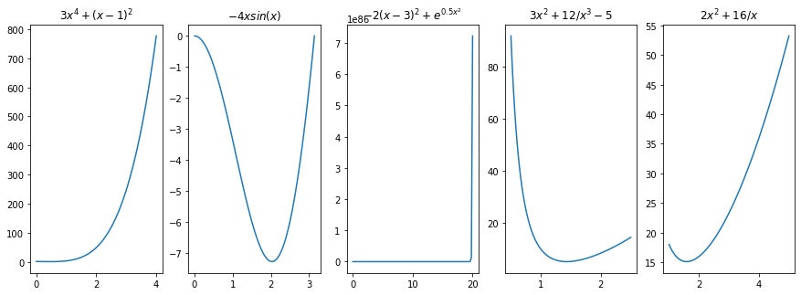
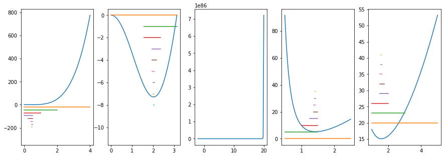
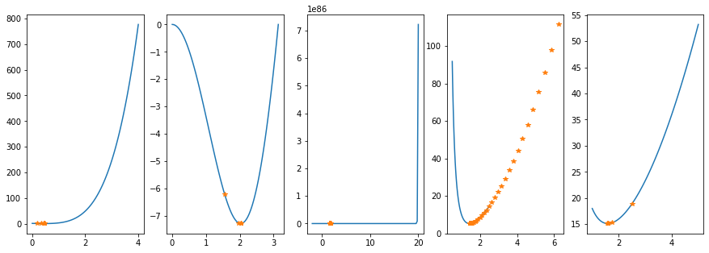
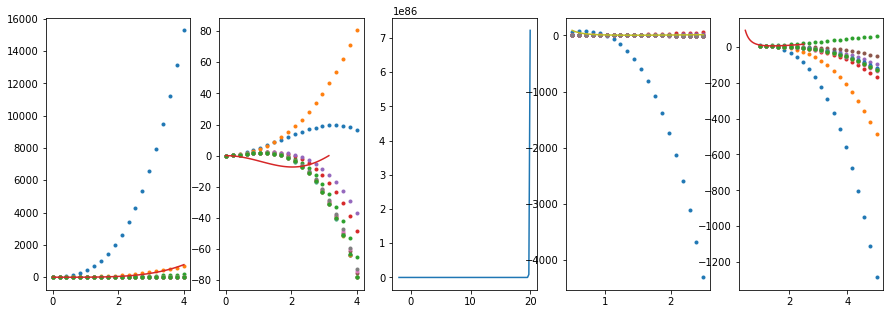
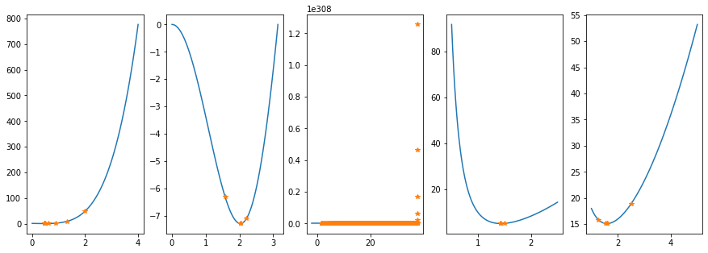
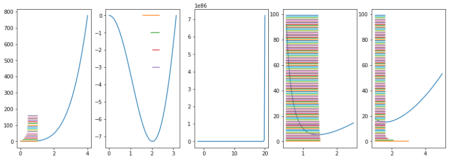
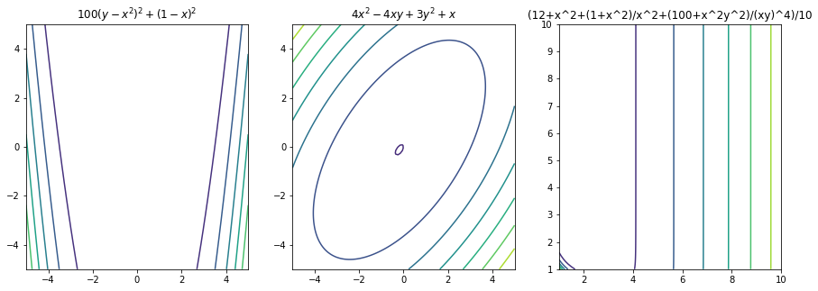
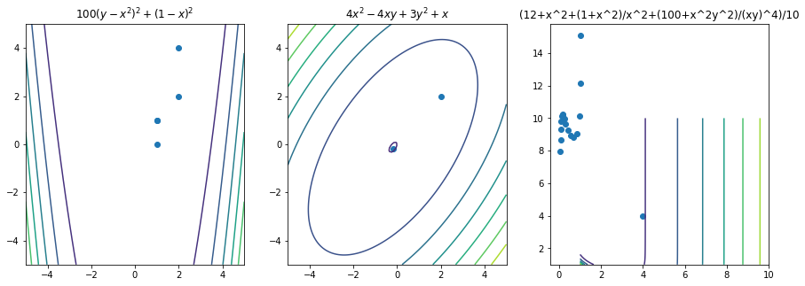

# I. Casos unidimensionales

## Detalles de la experimentación
### Detalles generales

Todos los algoritmos fueron diseñados como una función. Dependiendo de lo que necesitaba la función se le otorgaban los distintos argumentos para que pudiera correr. Además se documentaron las entradas de las distintas funciónes. Finalmente todas la funciónes tienen un argumento que es la función a evaluar. También se trató que fuera el último argumento de las funciónes. Si se quiere ver el código más a detalle se adjunto en una carpeta separada tanto en un cuaderno de python como en archivos separados.

### Bisección

Para el método de la bisección la única función que no funcionó fue la tercera, en vez de ir para abajo fue para arriba y encontró el máximo.

### Gradiente Descendente

Para el método de gradiente descendente se utilizó para casi todos el mismo tamaño de paso ($\alpha$), excepto con la tercera función que daba un desbordamiento en la memoria si se utilizaba un tamaño de paso tan grande. Es por eso que se tuvo que utilizar un $\alpha$ mucho más pequeño.

### Ajuste Polinomial Cúbico

Nuevamente la tercera función dió un desbordamiento en la memoria y no se pudo ni siquiera ejecutar el programa.
Apartando a la tercera función, todos los demás funcionaron bien con menos de 20 iteraciónes.

### Newton-Raphson

El método de **Newton-Raphson** funcionó a la perfección y relativamente rápidamente encontró la solución para todos los problemas.

La condición inicial que se utilizó para todos los algoritmos fue la mitad del campo de búsqueda.

### Secante

El algoritmo de la secante nuevamente no se pudo realizar para el ejercicio tres ya que daba un desbordamiento en la memoria. 

Cabe mencionar que el límite de iteraciónes ($n$) que se utilizó fue el de 100 iteraciones y constantemente fue la que dió los resultados con la mayor cantidad de iteraciones.

## Tablas de resultados

En las siguientes tablas se resume lo encontrado para los distintos algoritmos. Si se quieren analizar a mayor profundidad los resultados se recomienda ver el archivo de Excel que tiene todos lo resultados y no la información sintetizada.

$$3x^4+(x-1)^2; 0 \leq x \leq 4$$

|Algoritmo|Iteraciónes | Resultado|
|----------|------------|-----------|
|Bisección| 12 | 0.4501953125| 
| Gradiente Descendente| 6 | 0.450687401889157|
| Ajuste Polinomial Cúbico|13| 0.450696220859389| 
|Newton-Raphson|8|0.450698825146114 |
|Secante|57|0.450593495273513  |

$$-4xsin(x); 0 \leq x \leq \pi$$

|Algoritmo|Iteraciónes | Resultado|
|----------|------------|-----------|
|Bisección| 13 |2.0286895919787606 |  
| Gradiente Descendente| 5 |2.02878295362472|  
| Ajuste Polinomial Cúbico | 13 | 2.02873316922321 |  
|Newton-Raphson| 4 | 2.02875783820645 | 
|Secante| 4 | 2.02873013887062 | 

$$2(x-3)^2+e^{0.5x^2}; -100\leq x \leq 100$$

|Algoritmo|Iteraciónes | Resultado|
|----------|------------|-----------|
|Bisección| 17 | 99.99923706054688  |  
| Gradiente Descendente|39| -2.12866311237241  | 
| Ajuste Polinomial Cúbico| Errores. | |  
|Newton-Raphson| 1401 | -2.12868055620027|  
|Secante| Errores. | | 

$$3x^2+\frac{12}{x^3}-5;0.5 \leq x \leq 2.5$$

|Algoritmo|Iteraciónes | Resultado|
|----------|------------|-----------|
|Bisección| 11 | 1.4306640625 |  
| Gradiente Descendente| 51 | 1.43099426178136 |  
| Ajuste Polinomial Cúbico| 18 | 1.43095030265637 |  
|Newton-Raphson| 4 | 1.43096907580875 | 
|Secante| 100 | 1.43144792981206 | 

$$2x^2+\frac{16}{x};1 \leq x \leq 5$$

|Algoritmo|Iteraciónes | Resultado|
|----------|------------|-----------|
|Bisección| 9 |1.5859375| 
| Gradiente Descendente| 6 | 1.58748163048276 |  
| Ajuste Polinomial Cúbico| 13 | 1.58740408872363 |  
|Newton-Raphson| 6 | 1.58740105194021  | 
|Secante| 100 | 1.58740105196820  | 

## Discusión de Resultados
### Resultados en general

Podemos ver que la mayoría de los algoritmos son generalistas. Funcionan para casi todas las funciónes y normalmente encuentran las soluciónes en la misma cantidad de tiempo.

El tercer ejercicio fue interesante ya que rompió varios de los algoritmos.
Tanto para el algoritmo de ajuste polinomial cúbico como para el de la secante, en este ejercicio se puede ver que no llegó a ningún resultado.

### Bisección

El algoritmo de la bisección funcionó para casi todas las funciones, sólamente el tercer ejercicio encontró el máximo en vez del mínimo. 

También cabe aclarar que para el tercer caso, el algoritmo sube de una forma tan rápida que las líneas que marcan el camino de los algoritmos se pierden.

### Gradiente Descendente

Fue uno de los pocos algoritmos que logró encontrar las soluciónes para todos los mínimos. Además cabe destacar que lo hizo en relativamente pocas iteraciones.

### Ajuste Polinomial Cúbico

No logró encontrar la solución del tercer ejercicio, pero de ahí en más, encontró las soluciónes relativamente rápido. 

Podemos ver en la figura como va modificando la trayectoria y como se va a ajustando a nuestra función original este polinomio.

### Newton-Raphson

Podemos ver que este algoritmo es muy bueno, solo que el espacio de búsqueda no le ayudó del todo ya que en el caso del ejercicio tres estuvo buscando en más de 1000 iteraciónes la solución.
Si utilizamos el promedio para evaluar este algoritmo no le fue bien, pero si descartamos el caso del espacio de búsqueda increíblemente grande fue un muy buen algoritmo.

### Secante

El algoritmo de la secante constantemente llegó al límite de iteraciones o llegó a hacer más iteraciónes que el resto de los algoritmos. Además de que el tercer ejercicio no se logró ejecutar.

## Conclusión

En conclusión podemos ver que el mejor de los algoritmos fue el de gradiente descendente, aunque en algunos casos se tardó un poco en dar un resultado siempre dió un resultado correcto. En segundo lugar tenemos el algoritmo de Newton-Raphson que solo por un caso no es el mejor, pero sin el caso es en definitiva el mejor. En tercer lugar el de la bisección. En cuarto lugar tenemos el algoritmo de ajuste polinomial cúbico que varias no logró encontrar una solución y dió errores al tratar de encontrar una solución concreta a un problema. Finalmente podemos ver que el algoritmo de la secante es el peor algoritmo para encontrar una solución concreta ya que es el que tardó más tiempo en encontrar una solución concreta.

# 2. Casos multivariados

## Detalles de la experimentación
### Algoritmo de Gradiente Descendente

Para este algoritmo ya se tenían las bases del caso unidimensional, el único problema es que la implementación de la generalización es mucho menos precisa con el tamaño del paso ($\alpha$). 

Se tuvo que utilizar un $\alpha$ mucho más pequeño ya que los resultados eran muy poco precisos antes de cambiar este valor.  Pero esto conllevo a que se tuvieran que utilizar muchas más iteraciónes para que el algoritmo pudiera avanzar en la función ($f$) designada.

También cabe mencionar que se puso una limitante en las iteraciónes ($n$) que se podían llegar a hacer, este límite fue de 10 000. Una de las funciónes llegó a utilizar todo estas iteraciónes.

### Algoritmo de Newton

El algoritmo de Newton es la generalización del algoritmo de **Newton-Raphson**, y toma varias de las propiedades del mismo y las aplica a varias dimensiones. 

En este caso, el límite de iteraciónes ($n$) también se dejó como 10 000, pero ninguna pasó de las 20 iteraciónes. 

También tenemos que tener en cuenta que algunas funciónes al generar el Hessiano no tienen un Hessiano inverso ya que el determinante de la matriz es cero. En esos casos se intentó tanto evaluar antes de hacer el Hessiano inverso y también evaluar la matriz y después sacar la matriz inversa, en ninguno de los dos casos se logró obtener un resultado satisfactorio ya que no existían ninguna de las dos matrices inversas gracias a que su determinante era cero.

## Tablas de resultados
En las siguientes tablas se resume lo encontrado para los distintos algoritmos. Si se quieren analizar a mayor profundidad los resultados se recomienda ver el archivo de Excel que tiene todos lo resultados y no la información sintetizada.

El esquema general de las tablas es el siguiente y para cada uno de los problemas se utilizó una tabla distinta.

$$100(x_2-x_1^2)^2 + (1-x_1)^2; -5 \leq x1, x2, \leq 5$$

|Algoritmo|Iteraciónes | Resultado| 
|----------|------------|-----------|
| Gradiente Descendente |6897 |[1.026, 1.052] | 
| Newton | 4 |[1.000, 1.000] | 

$$4x^2_1-4x_1x_2+3x_2^2+x_1; -5 \leq x_1, x_1\leq 5$$

|Algoritmo|Iteraciónes | Resultado|
|----------|------------|-----------|
| Gradiente Descendente | 2180 | [-0.1840, -0.1205] |  
| Newton | 2 | [-0.1875, -0.125] | 

$$\frac{1}{10}(12+x_1^2+\frac{1+x_1^2x_2^2}{(x_1x_2)^4}) ; 0 \leq x1, x2, \leq 10$$

|Algoritmo|Iteraciónes | Resultado|
|----------|------------|-----------|
| Gradiente Descendente | 10 000| [1.2997, 2.9492] |  
| Newton | 15 | [1.0003, 21.7406] | 

$$x_1^3+x_2^2+x_3; -2 \leq x_1, x_2, x_3 \leq 2$$

|Algoritmo|Iteraciónes | Resultado|
|----------|------------|-----------|
| Gradiente Descendente | 5603 | [0.0577279071771581, 2.68276956068070e-5, -3.60399999999960] |  
| Newton | ERROR | | 

$$\frac{1}{3} \sum_{i=1}^3 (x^4_i - 16x_i^2 + 5x_i); -8 \leq x_1,x_2, x_3 \leq 8$$

|Algoritmo|Iteraciónes | Resultado|
|----------|------------|-----------|
| Gradiente Descendente | 620 | [2.74675201828480, 2.74675201828480, 2.74675201828480] |  
| Newton | 5 | [2.74680277099086, 2.74680277099086, 2.74680277099086]| 

## Discusión de Resultados

Se puede ver claramente que para el algoritmo de *gradiente descendente* se tuvieron muchas más iteraciónes, para ser exactos si se saca un promedio de todas las iteraciónes se obtiene un resultado de 5060 iteraciones por problema. 

Esto es mucho más que cualquier otro algoritmo, si se compara con el método de Newton, y contamos el caso que no se pudo resolver como 10 000 iterciónes entonces tenemos un promedio de 2005 iteraciónes. Esto a primera vista nos llevaría a pensar que en promedio el algoritmo de Newton es un poco más de dos veces más rápido que el del Gradiente. Pero si quitamos el caso que nos daba error entonces tenemos que el promedio del algoritmo de Newton es de 6.5 iteraciónes. Si utilizamos este promedio entonces tendríamos que en promedio, el algoritmo de Newton es 778 veces más rápida. 

Podemos ver claramente que el algoritmo de Newton es mucho más rápido que el del gradiente descendente, pero el problema es que el algoritmo no siempre funciona. Entonces, hay que considerar lo que queremos. Tener un algoritmo que siempre funcione y se tarde un rato o un algoritmo mucho más rápido pero que tiene que estar cuidando que sus condiciónes sean propicias.

El algoritmo de Newton se beneficia de campos de búsqueda relativamente pequeños y de no tener muchos máximos y mínimos, es por eso que en casos de tener un solo mínimo podemos encontrar rápida y exactamente el resultado.

## Conclusión

En conclusión, tenemos que tener en cuenta que en el mundo de los algoritmos multivariados, los resultados pueden variar mucho. Como se vió en los resultados, el algoritmo de Gradiente Descendente encuentra generalmente una solución que satisface nuestras necesidades pero que tarda mucho más que el algoritmo de Newton. Mientras que el algoritmo de Newton es mucho más rápido pero tiene que cumplir ciertas restricciones que pueden llegar a ser difíciles de cumplir. Es por eso que se tienen que tener en cuenta las ventajas y desventajas de estos algoritmos.