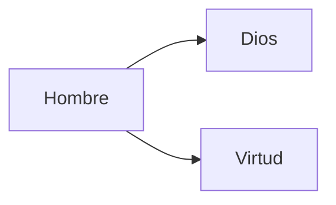

# Esquema básico

No es este el esquema pero tiene dos secciones.

# Bienes, virtudes, normas

- **Bienes**: Son el objetivo, nos ayuda a ser felices.
	- Son el fundamento de las normas: Si no protegen bienes, no sirven.
- **Normas:** No nos hacen conseguir el bien, pero nos ayudan de modo "pedagógico" a recordar dónde está el bien.
	- Protegen y ubican los bienes.
	- Se enuncian de manera negativa.
	- No abarcan a todas las dimensiónes del bien.
- **Virtudes:** Son las acciones o decisiones concretas con las que sonseguimos el bien.
	- Pueden ser muy variadas las virtudes que se requieren para alcanzar bienes en circunstancias 
	- Tiene un contenido siempre contenido positivo, relacionado con el bien.
	- Si no se viven el bien no se consigue.
	- La definición: **May the force be with you.** *Tener esa fuerza*.

# ¿Qué son los 10 mandamientos?

Son una serie de normas para custodiar algunos de los bienes primordiales para la vida humana.

1. Mandamientos de la primera tabla son del 1 al 3.
	- La relación del hombre con Dios.
2. Mandamientos de la segunda tabla. 
	- La relación del hombre con los bienes que son Dios.
# Bienes y virtudes

# Los mandamientos clave de la libertad